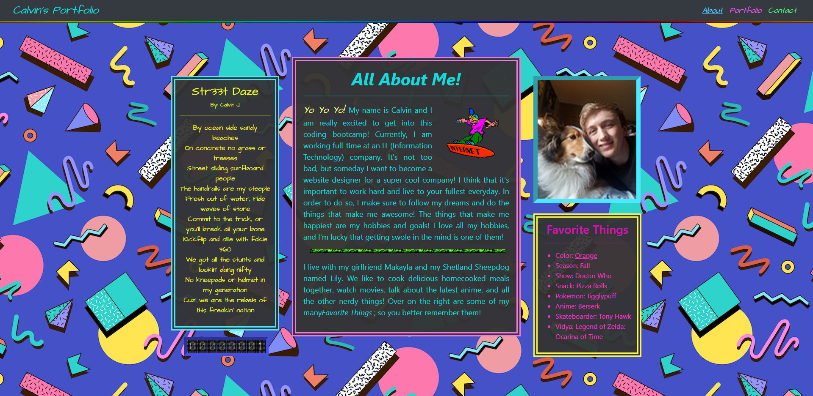
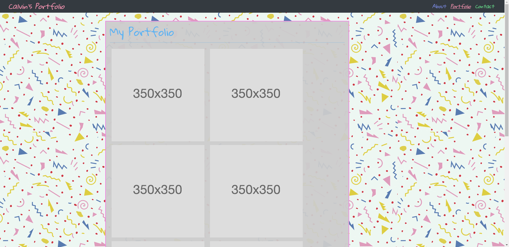
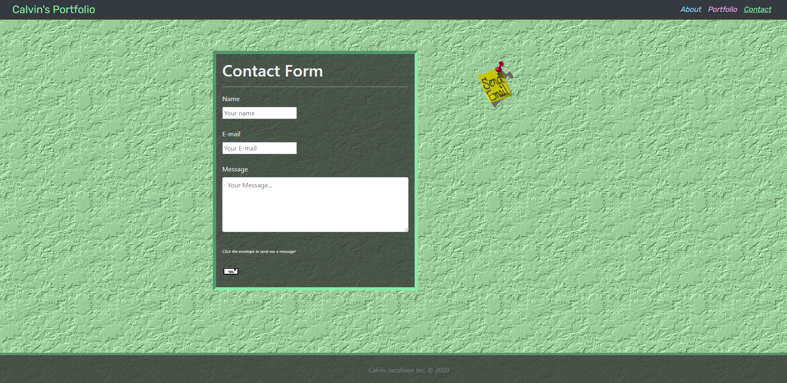

# Unit 02 CSS and Bootstrap Homework: Responsive Portfolio Readme

This is the second homework in the Fullstack coding bootcamp. In this Homework we are dealing with CSS and Bootstrap implimentation within a multi-page website.

## Descripion and Overview
Hey, this is my website portfolio that shows everything all about me! I finished this website in about 4 days, and spent about 20 or so hours on it. It was really fun, and this is my first multipage website that I've developed. 
This page includes a...

* About (index) page

* Portfolio page

* Contact page

This website has a couple of interesting easter eggs that I setup; try hovering over all the images and there will be special text!
Additionally, there is some more stuff that I would like to do with this website once I learn so more html, so look out for an update!

------------------------------
----- UNDER CONSTRUCTION -----

------------------------------

## Prerequisites and expectations for this Homework

* Using Bootstrap, develop your portfolio site with the following items:

   * A navbar

   * A responsive layout

   * Responsive images

* The Bootstrap portfolio should minimize the use of media queries.

* Screenshots are provided as a reference in the `Assets/Images` folder. Your app does not need to be _exactly_ like the images. Use Bootstrap to create a similar, responsive layout.

Each of things have been completed.

## Screenshots

## Link to website below

https://calvinjacobsen.github.io/Homework2/index.html