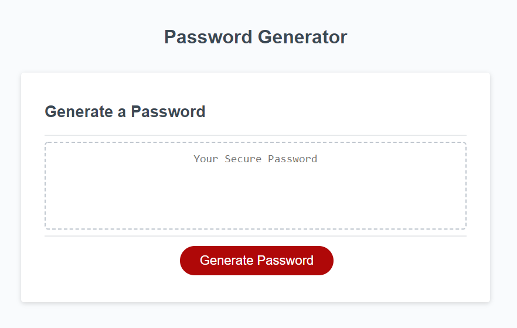
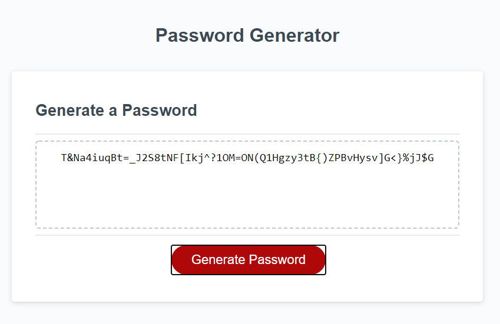

# Homework 3 Javascipt Password generator 

This is the third homework assignment for the Fullstack coding bootcamp. In this homework assignment we had to develop javascript code that would generate a random password based on user critera.

## Desription and Overview

This is my random password generator that I built. The JS code is mine except for the writePassword() function. The index.html and CSS was provided for this assignment as well. My task was to create Javascript that would allow the user to generate a random password based on a set of criteria that they specify. The bullet points below are my prompts for the code.

* Number of characters long the password is (8 - 128)

* What kind of characters to include in the password ex. Uppercase, lowercase, numerals, special characters...

These are the two things that I  prompted for via js alert functions and after that a function is ran to generate the password.

## Requirements for Assignment

Below are the user requirements for the application

```
GIVEN I need a new, secure password
WHEN I click the button to generate a password
THEN I am presented with a series of prompts for password criteria
WHEN prompted for password criteria
THEN I select which criteria to include in the password
WHEN prompted for the length of the password
THEN I choose a length of at least 8 characters and no more than 128 characters
WHEN prompted for character types to include in the password
THEN I choose lowercase, uppercase, numeric, and/or special characters
WHEN I answer each prompt
THEN my input should be validated and at least one character type should be selected
WHEN all prompts are answered
THEN a password is generated that matches the selected criteria
WHEN the password is generated
THEN the password is either displayed in an alert or written to the page
```
Each of these criteria are met...

## Screenshot of working website





## Link to website

URL: https://calvinjacobsen.github.io/Homework3/Develop/index.html
